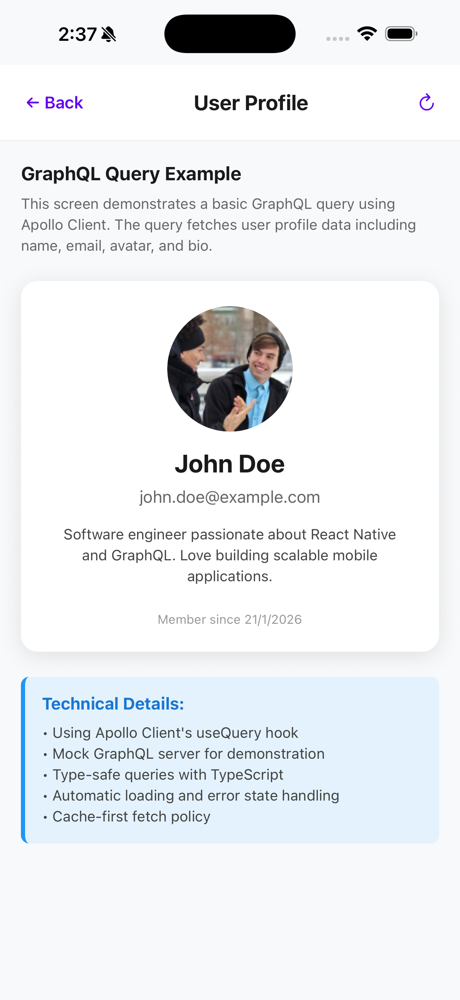
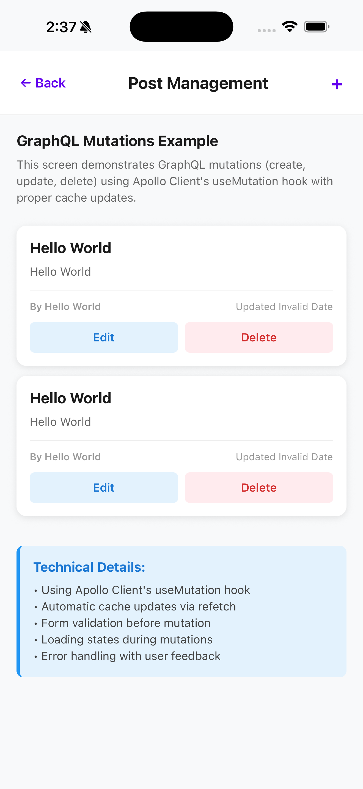
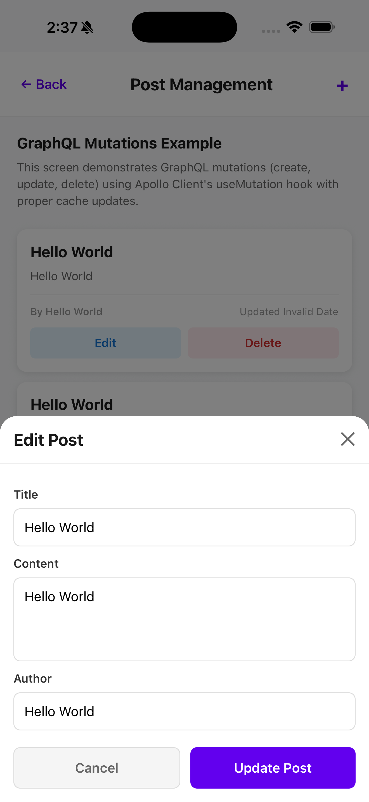
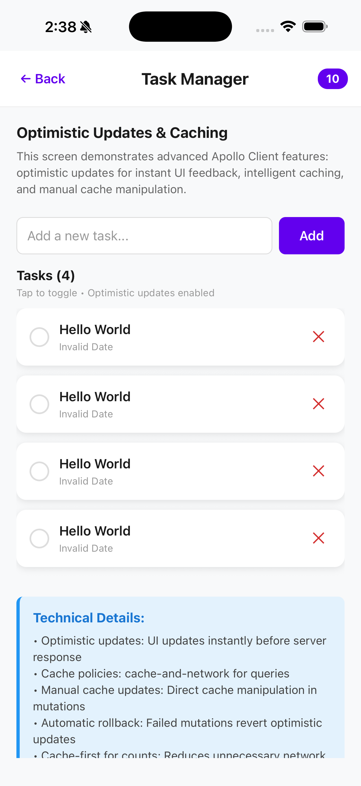
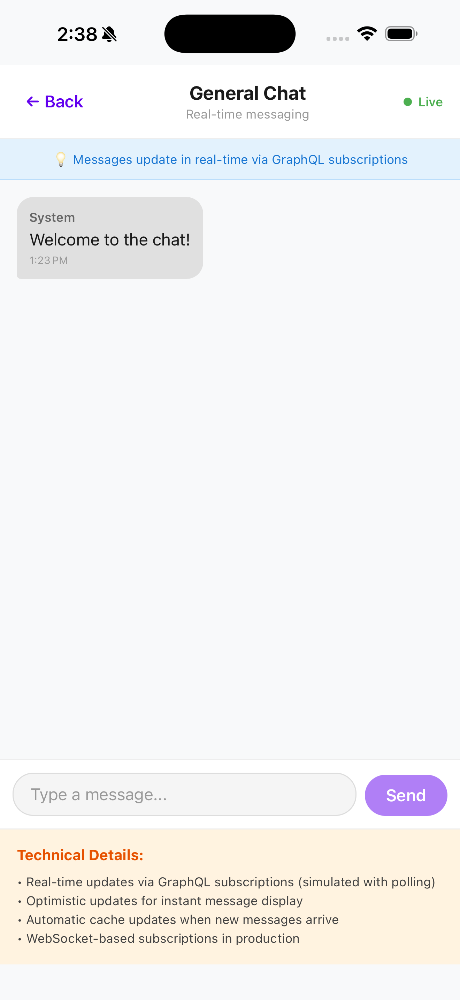

# React Native Snippets & Assignments

A professional-grade React Native repository showcasing advanced architectural patterns, clean code principles, and modular UI development.

---

## 📱 Showcase

| Assignment Dashboard | Event Registration (Sample) |
| :---: | :---: |
|  |  |

### GraphQL Assignments (5–8)

| Assignment 5 – User Profile (Query) | Assignment 6 – Post Management (Mutations) |
| :---: | :---: |
|  |  |

| Assignment 6 – Create / Edit Post Modal | Assignment 7 – Tasks (Caching & Optimistic Updates) |
| :---: | :---: |
|  |  |

| Assignment 8 – Real-time Chat (Subscriptions) |
| :---: |
|  |

---

## 🏗️ Architectural Principles

This project serves as a reference for scalable React Native applications, adhering to industry best practices:

-   **Clean Architecture**: Separation of concerns into Layered Architecture (Core, Data, Presentation) to ensure business logic is isolated from framework dependencies.
-   **MVVM (Model-View-ViewModel)**: Decoupling UI logic from rendering using custom hooks as ViewModels, making components thin and highly testable.
-   **Atomic Design**: A modular UI structure where components are broken down into **Atoms**, **Molecules**, and **Organisms** for maximum reusability.
-   **TypeScript**: Strict type safety across the entire codebase to reduce runtime errors and improve developer experience.

---

## 🚀 Existing Assignments

1.  **[Assignment 1: Contact Form](file:///src/assignment1/README.md)**: Foundation of Clean Architecture and Atomic Design with real-time validation.
2.  **[Assignment 2: Event Registration](file:///src/assignment2/README.md)**: Intermediate UI patterns, input masking, and conditional visibility logic.
3.  **[Assignment 3: Multi-Step Profile Builder](file:///src/assignment3/README.md)**: Advanced state persistence (MMKV), multi-step wizard logic, and complex form handling.
4.  **Assignment 4: High-Performance Social Feed**: Virtualized list, memoization strategy, and optimistic UI for 60 FPS scrolling.
5.  **Assignment 5: GraphQL Basics – User Profile Query**: Apollo Client `useQuery` with typed GraphQL, loading/error handling, and mock server.
6.  **Assignment 6: GraphQL Mutations – Create/Update Posts**: `useMutation` patterns, cache updates, and form-driven workflows.
7.  **Assignment 7: GraphQL Caching & Optimistic Updates**: Advanced cache policies, optimistic updates, and pagination.
8.  **Assignment 8: GraphQL Subscriptions & Real-time Chat**: Real-time messaging using GraphQL (simulated subscriptions) and optimistic UX.

---

## 🛠️ Tech Stack

-   **Core**: React Native, TypeScript
-   **Styling**: Vanilla CSS (StyleSheet) with a custom design system
-   **State & Persistence**: React Hooks, MMKV
-   **Structure**: Atomic Design, Clean Architecture

---

## 🏃 Getting Started

### 1. Install Dependencies
```sh
npm install
cd ios && pod install && cd ..
```

### 2. Start Metro
```sh
npm start
```

### 3. Run the App
```sh
# Android
npm run android

# iOS
npm run ios
```

---

*Part of a continuous learning journey to master advanced React Native patterns.*
